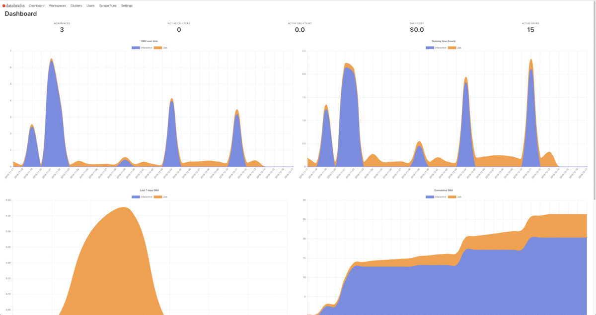

# Databricks Admin Center (DAC)
Databricks Admin Center (DAC) solves the problem of cost- and performance monitoring, maintenance and overview of Databricks workspaces, clusters and users in one place.




### Configuration
DAC has two configuration files:

_.env_
```bash
export FLASK_APP=dac.py
export FLASK_ENV=production
export DAC_CONFIG_PATH=configs/config.json
```
_configs/config.json_
```json
{
    "workspaces": [
        {
            "url": "westeurope.azuredatabricks.net/?o=[workspace_id]",
            "id": "[workspace_id]",
            "type": "[AZURE|AWS]",
            "name": "[workspace_name]",
            "token": "[token]"
          }, ...
    ],
    "prices": {
        "interactive": 1.0,
        "job": 1.0
    },
    "thresholds": [
    ],
    "scraper": {
        "interval": 270
    }
}
```

#### Sending config during run

After starting the UI, config files can still by send in. To submit a new configuration, use the `ui_uri:port/config` REST API endpoint: send the configuration as `json` payload in a `POST` request. Please note that currently the whole configuration must be submitted, the old one will be replaced.

Submission example using python:
```python
import requests
config = { ... }
requests.post("example_uri:port/config", json=config)
```

The response is a json object with 3 fields:
- "success": boolean, if the submission was successful
- "error": string | None, error message in case of unsuccessful submission, empty otherwise
- "info": json, the relevant part of config, in case of errors the problematic part of the config, otherwise the full config

Response examples:
- Successful submission:
    ```json
    {
        "success": true,
        "error": null,
        "info": { ... }
    }
    ```
- Missing interactive price config:
    ```json
    {
        "success": false,
        "error": "Missing price info",
        "info": {"prices": {"job": 0.15}}
    }
    ```

## Install

```bash
pip install -r requirements.txt
```

We recommend using virtualenv to run DAC. DAC requires Python 3.6+.

## Running
DAC can be run in a docker container or without it.
### Non-containerized running
1. To run the UI

```bash
flask run
```

2. To run the scraper:

```bash
# Only for the first run:
python main.py create_db

# To run the scraper
python main.py scrape
```

### Dockerized running

#### 1. Create the config files

#### 2. Build image
```bash
./scripts/create-docker
```
#### 3. Run image
```bash
./scripts/run-local
```

## Development

If you want to run Flask in development mode, change the following line in .env:

```bash
export FLASK_ENV=production
```

to

```bash
export FLASK_ENV=development
```

### Design doc and contributing

Main features, major architecture or code changes must be designed and planned in a design document. These documents are available on the DAC wiki. You are required to provide a design document if the feature you would like to contribute requires one. A minimal design doc template can be used [from the wiki](https://github.com/datapao/dac/wiki/Design-doc-template).

## Support

The main channel for DAC is the official DAC Slack, where you can ask any question. Feel free to join us!

Slack: [project-dac.slack.com](https://project-dac.slack.com)

## Roadmap

DAC Roadmap is available in the wiki: [Roadmap](https://github.com/datapao/dac/wiki/Roadmap)

The roadmap is subject to change. If you feel excited about certain features please let us know. Even better, if you consider contributing features feel free to contact the development team for any support you need.

## Sponsoring

DAC is currently developped with ❤️ at [Datapao](https://datapao.com). If you need a feature or you think DAC is useful, please consider sponsoring the development.
